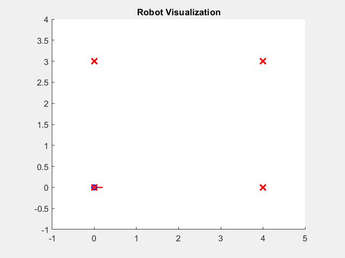
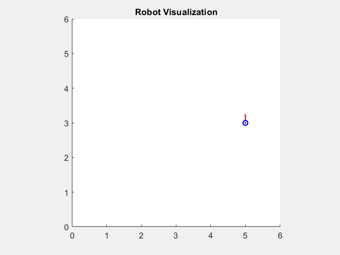
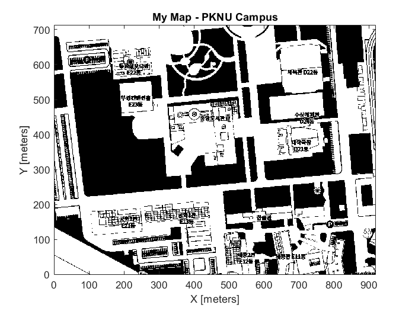
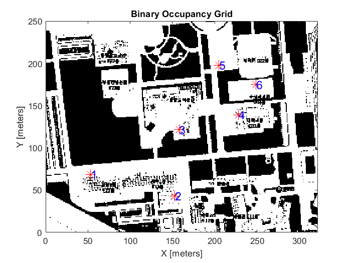
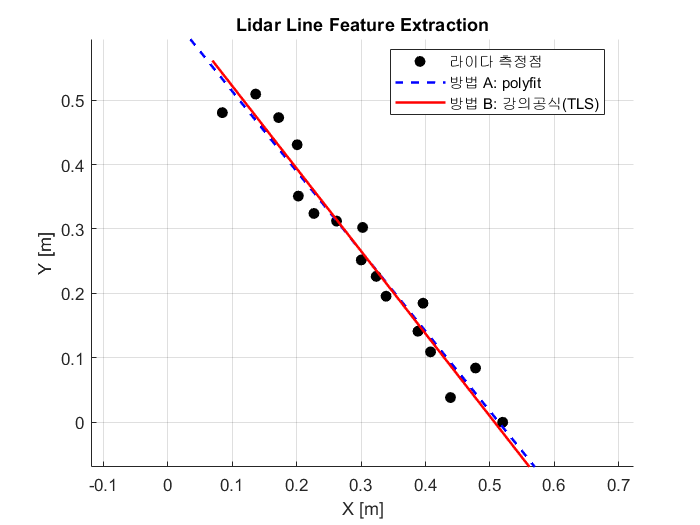
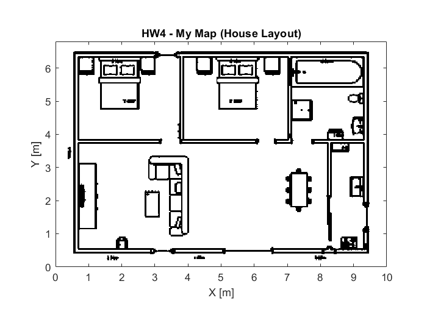
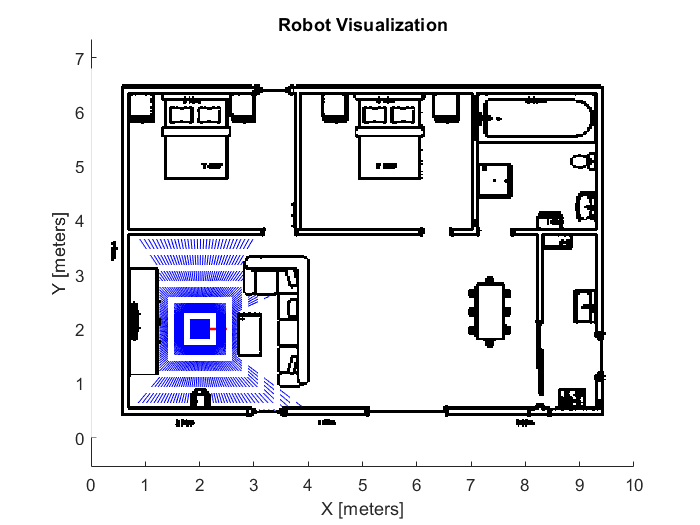
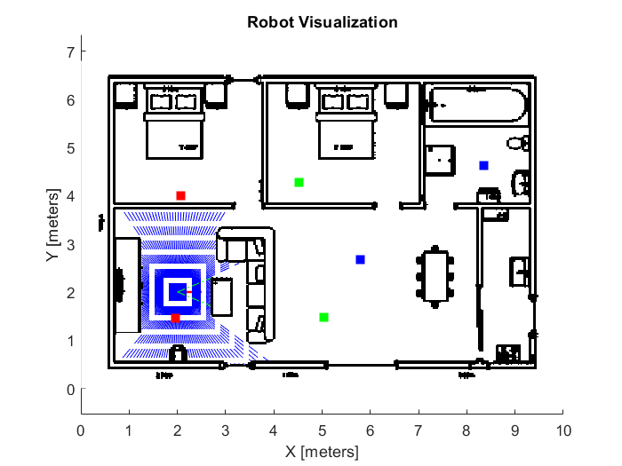
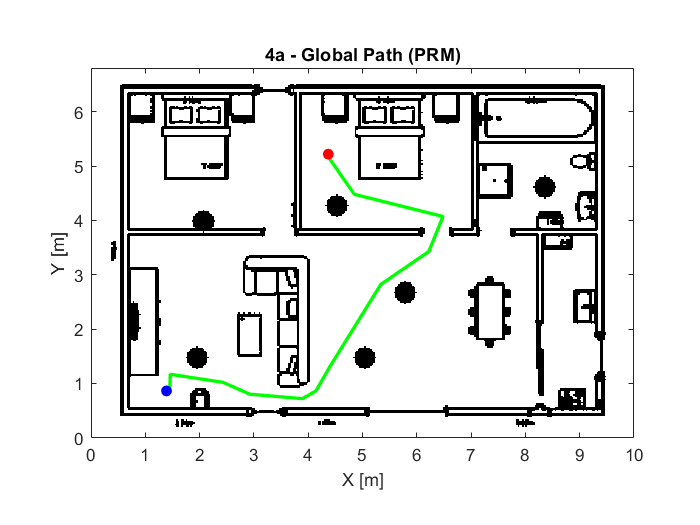
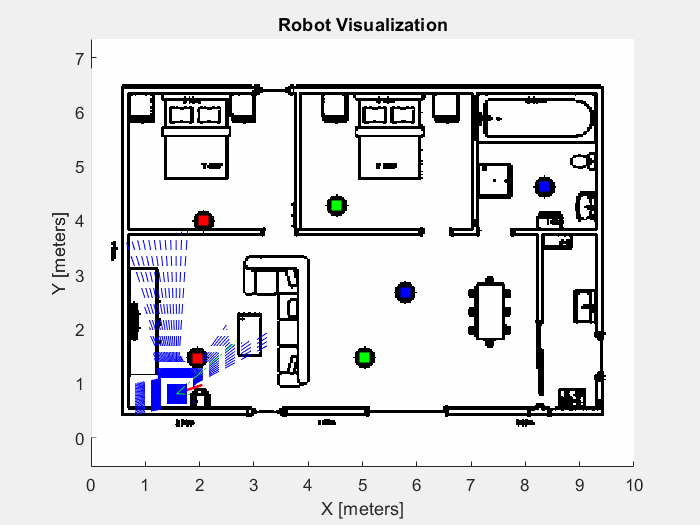

# AutoDrive — Mobile Robot Navigation & Perception (MATLAB)

> 자율주행 시스템(Autonomous Driving System) 강의의 **MATLAB 개인 과제 모음**.
> 모바일 로봇 시각화·경로 주행, 점유 격자 맵, 라이다 feature extraction,
> 자율주행(경로계획 + 추종)을 다룬다.

**📚 과목:** 자율주행 시스템 (Autonomous Driving System) · 부경대  
**💻 MATLAB 버전:** R2022b  

## 📂 구성

| 과제 | 내용 |
|------|------|
| **HW#1 — Robot Visualizer** | 경로 주행(사각형·원), 점유 격자 맵, waypoint 표시, (보너스) 맵 위 자율주행 |
| **HW#3 — Lidar Line Feature Extraction** | 라이다 거리 데이터로 직선(벽) feature 추출 |
| **HW#4 — 모바일 로봇 자율주행** | Lidar + Object Detector(장애물 6개) + 전역(PRM)·지역(VFH) 경로계획 + 모션제어 |

 

---
---

# HW#1 — Robot Visualizer I (Waypoint & Map)

> MATLAB **Mobile Robotics Simulation Toolbox**로 2D 모바일 로봇의
> **경로 주행 · 점유 격자 맵 · waypoint 표시**를 구현하고,
> 과제 범위를 넘어 **맵 위 자율주행**까지 도전했다.

**📅 수행 기간:** 2024.04.04 ~ 2024.04.18  
**📚 과목:** 자율주행 시스템 (Autonomous Driving System)  
**💻 MATLAB 버전:** R2022b  

---

## 🛠 사용 기술

- **언어/환경**: MATLAB
- **툴박스**: Mobile Robotics Simulation Toolbox, Image Processing Toolbox, Navigation Toolbox
- **핵심 함수/개념**:
  `Visualizer2D` · `binaryOccupancyMap` · `inflate` · `mobileRobotPRM` ·
  `controllerPurePursuit` · `differentialDriveKinematics` ·
  점유 격자(Occupancy Grid) · 전역 경로계획(PRM) · 경로추종(Pure Pursuit)

## 경로 주행 (Task 1 · 2)

로봇이 경로를 따라 이동하며 **항상 진행 방향을 바라본다**.

| ① 사각형 경로 — `θ = atan2(dy, dx)` | ② 원 경로 — `θ = φ + π/2` (접선) |
|:---:|:---:|
|  |  |

## 맵 만들기 (Task 3 · 4)

| ③ 점유 격자 맵 — 네이버 지도 캡쳐를 `imread→rgb2gray→임계값→binaryOccupancyMap`으로 변환 | ④ 로봇 + waypoint 표시 — 맵에 `viz.mapName` 적용, `ginput`으로 찍은 경유점(5개↑) 표시 |
|:---:|:---:|
|  |  |

## (보너스) 맵 위 자율주행 (Task 5)

과제 범위를 넘어, 로봇이 경유점을 따라 **실제로 주행**하도록 구현했다.

- **안전여유**: `inflate`로 장애물을 로봇 반경만큼 부풀린 안전 지도 생성
- **전역 경로계획**: `mobileRobotPRM`로 건물을 피해 경유점들을 잇는 경로 생성
- **경로추종**: `controllerPurePursuit` + `differentialDriveKinematics`로 주행 시뮬레이션

> ⚠️ **한계**: 계획된 경로는 장애물을 피하지만, Pure Pursuit은 **전진 전용이며
> 주행 중 충돌 검사가 없어** 급커브에서 경로를 벗어나 일부 벽을 침범한다.
> 원인 분석과 개선 방향(HW4에서 Lidar 기반 지역 회피로 보완)은
> **[TROUBLESHOOTING.md](TROUBLESHOOTING.md)** 에 정리했다.

---

## ▶ 실행 방법

1. MATLAB에서 `AutoDrive_HW1_RobotVisualizer.m`을 연다.
2. 작업은 `%%` 섹션으로 나뉘어 있다.
   - 한 섹션 실행: 해당 섹션에 커서 두고 **Ctrl + Enter**
   - 여러 섹션이 변수를 공유하는 작업(5번·보너스): 해당 블록 **전체 선택 후 F9**
3. 실행하면 시각화 창이 뜨고, 각 작업별 GIF가 작업 폴더에 저장된다.

> 필요 툴박스: Mobile Robotics Simulation Toolbox, Image Processing Toolbox, Navigation Toolbox

---

## 🔎 한계 & 다음 단계

이 프로젝트는 **자율주행 파이프라인(계획 → 추종 → 제어)을 이해·구현한 데모**다.
주행 중 실시간 충돌 회피(Lidar 기반 지역 계획)는 포함되지 않아, 이는 후속 과제(HW#4)에서
**Lidar + Object Detector + local path planning**으로 보완할 예정이다.
자세한 분석은 [TROUBLESHOOTING.md](TROUBLESHOOTING.md) 참고.

 

---
---

# HW#3 — Lidar Line Feature Extraction (MATLAB)

> **문제**: 라이다가 0°~80°를 5° 간격으로 훑어 얻은 17개의 거리 측정값(각도 θ, 거리 ρ)이 주어진다.
> 이 점들은 측정 잡음이 있지만 대체로 **하나의 직선(벽)** 위에 놓여 있다.
> 이 점들에 가장 잘 맞는 직선을 찾아, 극좌표 normal form **(r, α)** 로 표현하라. (목표 답: α ≈ 37.36°, R ≈ 0.4)

**📅 수행 기간:** 2024.05.09 ~ 2024.05.15  
**📚 과목:** 자율주행 시스템 (Autonomous Driving System)  
**💻 MATLAB 버전:** R2022b  

## 개념

- 라이다는 각도(θ)마다 거리(ρ)를 측정한다 → **점들의 집합**.
- 이 점들을 하나의 **직선**으로 압축(feature extraction)하고, 극좌표 normal form **(r, α)** 로 표현한다.
  - `r` = 원점(로봇)에서 직선까지의 **수직 거리**, `α` = 그 수직선이 x축과 이루는 **각도**.
- 벽을 직선 feature로 뽑는 것은 **지도 작성·위치추정(SLAM)** 과 팀프로젝트 **"라인 추종"** 의 기반이다.

## 구현 — 두 방법 비교

| 방법 | 최소화 대상 | 결과 (α, r) |
|------|------------|-------------|
| **A. `polyfit`** | y방향(수직) 오차 | 38.85°, 0.40 |
| **B. 강의공식 (Total Least Squares)** | 직선까지의 **수직거리** 오차 | 37.96°, 0.40 |

- 강의자료 정답: **α ≈ 37.36°, R ≈ 0.4** → **방법 B(TLS)가 정석이며 정답과 일치**.
- 방법 A(`polyfit`)도 약 38.85°로 "유사한 답"(과제 허용 기준)을 만족한다.

코드를 실행하면 아래처럼 **라이다 측정점(검은 점)** 과 **두 방법의 직선**(파란 점선 = polyfit, 빨간 실선 = 강의공식 TLS)이 함께 그려진다.

## 파일

- `AutoDrive_HW3_LineFeatureExtraction.m` — 라인 feature extraction 코드 (방법 A/B + 그래프)

자세한 분석(두 방법의 차이, 부호 처리, 변환식 버그)은 [TROUBLESHOOTING.md](TROUBLESHOOTING.md) 참고.

 

---
---

# HW#4 — 모바일 로봇 자율주행 (Differential Drive + Lidar)

> **문제**: 직접 만든 지도(집 평면도) 위에서 **차동구동 로봇**이 **Lidar**로 주변을
> 감지하며, 시작점에서 목표점까지 **벽·가구·장애물을 피해 자율주행**한다.
> (전역 경로계획 + 지역 회피 + 모션 제어의 3층 구조)

**📅 수행 기간:** 2024.05.24 ~ 2024.06.13  
**📚 과목:** 자율주행 시스템 (Autonomous Driving System)  
**💻 MATLAB 버전:** R2022b  

## 🛠 사용 기술

- **로봇**: Differential Drive Robot (`differentialDriveKinematics`)
- **센서**: Lidar (`LidarSensor`), Object Detector (`ObjectDetector`)
- **전역 경로계획(Global)**: PRM (`mobileRobotPRM`)
- **지역 회피(Local)**: VFH (`controllerVFH`) — 라이다 기반 실시간 회피
- **모션 제어**: Pure Pursuit (`controllerPurePursuit`)
- 맵 처리: `binaryOccupancyMap`, `imdilate`, `imresize`, `inflate`

## 구현 단계

| ① 집 평면도 → Occupancy Grid 맵 | ② Lidar 센서 부착 |
|:---:|:---:|
|  |  |

| ③ Object Detector + 장애물 6개 | ④ 전역 경로계획 (PRM) |
|:---:|:---:|
|  |  |

**자율주행 (전역계획 PRM + 지역회피 VFH + 모션제어 Pure Pursuit)**

## 🆚 HW#1 보너스 vs HW#4 — "올바른 계획 ≠ 안전한 실행"

> 흔한 오해: *"HW#4는 라이다가 있으니 당연히 회피되는 것"* → **그게 핵심이 아니다.**
> HW#1도 PRM으로 **충돌 없는 경로를 이미 계획**했다. 회피 실패는 "계획"이 아니라 **"실행"** 의 문제였다.

| 항목 | HW#1 보너스 | HW#4 |
|------|------------|------|
| 전역 경로계획 (충돌 없는 경로) | PRM ✅ | PRM ✅ |
| 모션 제어 | Pure Pursuit ✅ | Pure Pursuit ✅ |
| **주행 중 실시간 보정** | ❌ 없음 | ✅ Lidar + VFH |
| 결과 | 경로는 안전한데 **실행이 경로를 벗어나 벽 침범** | 벗어나도 **즉시 감지·보정해 회피** |

→ 두 과제 모두 "충돌 없는 경로"는 만들었다. 차이는 **그 경로를 벗어났을 때 잡아주는 반응 층(VFH)의 유무**다.
즉 **"올바른 계획 ≠ 안전한 실행"** — 그 사이를 메우는 지역 반응 제어가 필요하다는 것이 핵심 교훈.
(또한 라이다를 다는 것으로 끝이 아니라, VFH가 먼 벽에 과민반응하거나 전역경로와 충돌하지 않게 **튜닝하는 것 자체가 비자명한 작업**이었다.)

## 파일

- `AutoDrive_HW4_Navigation.m` — 맵 생성 → Lidar → Object Detector → 전역계획 → 지역회피 → 주행

자세한 구현 과정과 트러블슈팅(성능·통로 막힘·VFH 튜닝 등)은 [TROUBLESHOOTING.md](TROUBLESHOOTING.md) 참고.
